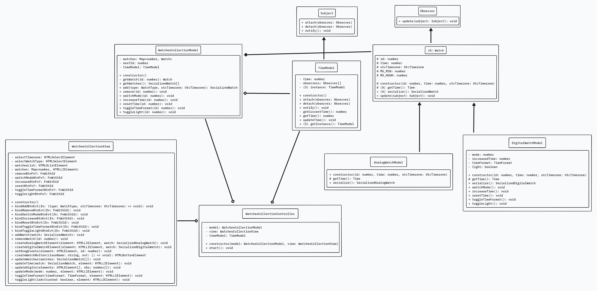

# watch-GE

MVC project made for the GE Healthcare's technical interview.

Link of the original repo with the instructions: [template-ts](https://github.com/Saradoc62/template-ts).

## UML diagram



## Usage

```bash
npm i
npm run dev
```
